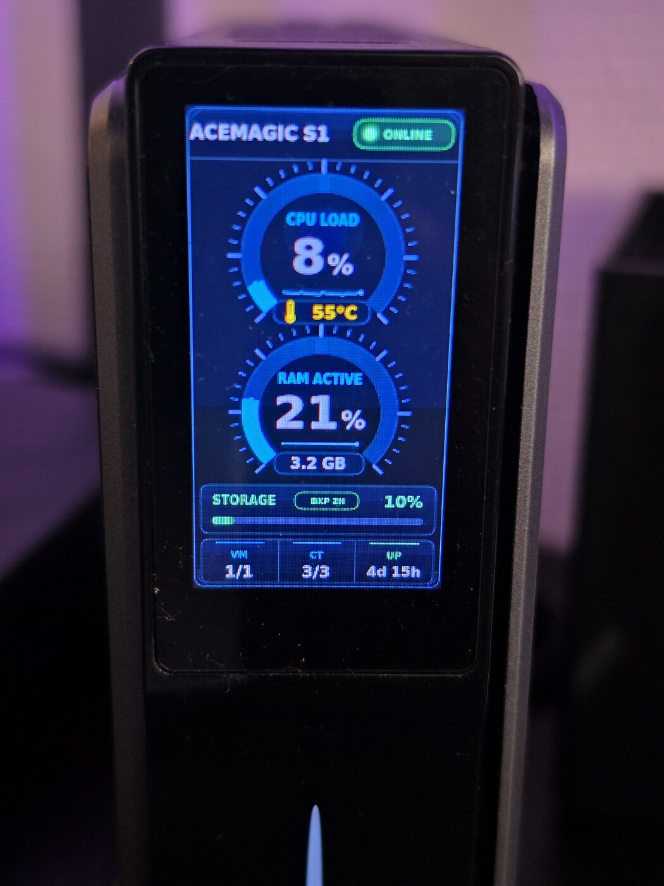
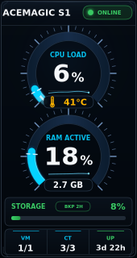
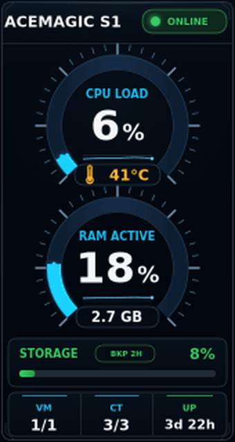
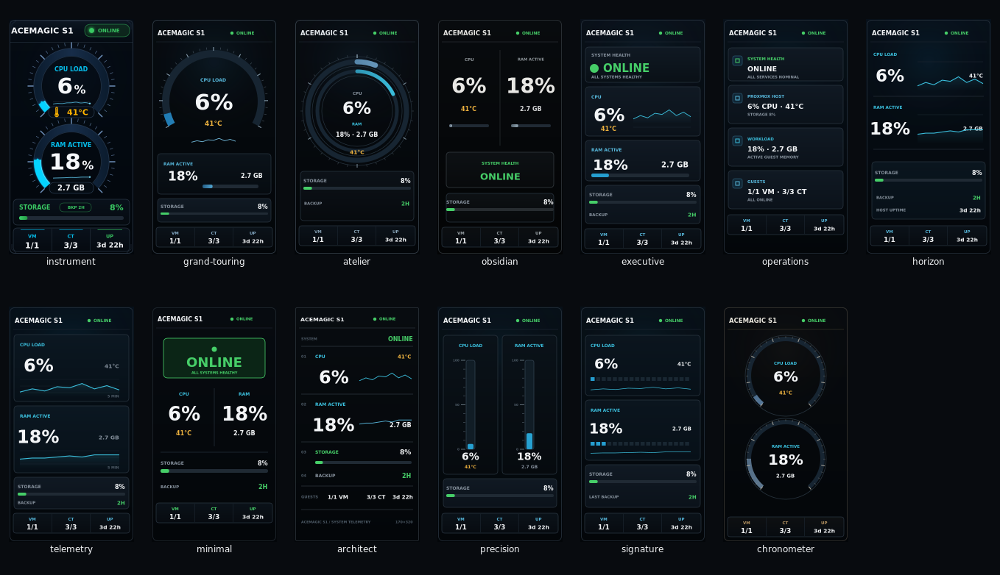
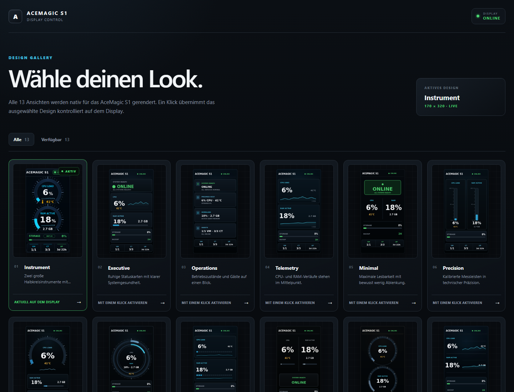

# AceMagic S1 Display

> **English summary:** Turn the built-in 170×320 LCD of the AceMagic S1 into a
> native Proxmox status display. The project provides 13 hardware-tested
> designs, read-only Proxmox metrics, guest and backup status, offline
> detection and a local design gallery — without Prometheus, Grafana or a
> separate database.
>
> [Install in about 10 minutes](#installation-in-about-10-minutes) ·
> [Design video](https://github.com/M-Lietz/acemagic-s1-display/releases/download/v0.1.2/acemagic-s1-design-showcase.mp4) ·
> [Online/offline video](https://github.com/M-Lietz/acemagic-s1-display/releases/download/v0.1.2/acemagic-s1-status-demo.mp4) ·
> [Release v0.1.3](https://github.com/M-Lietz/acemagic-s1-display/releases/tag/v0.1.3)

Ein natives 170×320-Systemdisplay für den **AceMagic S1**. Dreizehn
unterschiedliche Ansichten zeigen den Zustand eines Proxmox-Homelabs ruhig,
kompakt und auf dem echten TFT gut lesbar.

> **Projektstatus:** Alle 13 Designs und die lokale Gallery laufen produktiv
> und wurden einzeln auf dem echten TFT geprüft. Die erste öffentliche Version
> wird als `0.1.x` geführt, bis weitere Geräteinstallationen bestätigt sind.

<p align="center">
  
</p>

<p align="center"><em>Instrument-Design mit echten Proxmox-Live-Daten auf dem originalen AceMagic-S1-TFT.</em></p>







## Funktionen

- CPU-Auslastung und Temperatur des Proxmox-Hosts
- aktive RAM-Nutzung laufender VM und Container
- dynamischer VM-/CT-Status einschließlich gestoppter Gäste
- Storage-, Backup- und Uptime-Status
- fünfminütige CPU- und RAM-Trends ohne zusätzliche Datenbank
- `ONLINE`, `WARNING` und `OFFLINE` als klar erkennbare Zustände
- direkter USB-HID-Zugriff auf das TFT und Steuerung des LED-Streifens
- lokaler Healthcheck und systemd-Watchdog
- sichere lokale Gallery mit direkter Auswahl aller 13 Renderer

Die Anwendung benötigt weder Prometheus noch Grafana, InfluxDB oder einen
zusätzlichen Exporter. Messwerte kommen direkt aus der Proxmox-API, dem
vorhandenen Linux-`hwmon` und optional aus einer stark eingeschränkten
Gastprobe.

## Auf echter Hardware

Das Instrument-Design, die Designwechsel sowie der Wechsel zwischen `ONLINE`
und `OFFLINE` wurden auf einem echten AceMagic S1 aufgenommen und geprüft. Die
veröffentlichten Vorschauen stammen direkt aus denselben Renderern wie das TFT;
es existiert keine getrennte Demo-Implementierung.

## Projektstruktur

```text
s1panel/
├── designs/                     Katalog und gemeinsame Designvorschauen
├── gui/                         fokussierte Design-Gallery
├── lib/                         Metriken und sichere Designauswahl
├── sensors/system_status.js     lesender Proxmox-Collector
├── themes/                      13 freigegebene Themes
├── widgets/                     Referenz- und gemeinsamer Designrenderer
├── scripts/                     reproduzierbare Vorschauen
└── test/                        native Node.js-Tests
ops/                             systemd- und Gastprobe-Helfer
docs/                            Architektur, Design und Betrieb
```

Die USB-/HID-Laufzeit sowie kompatible Sensoren und Widgets basieren weiterhin
auf dem Upstream. Der frühere freie Editor wurde durch eine kleine sichere
Design-Gallery ohne Uploads, Widget-Editor oder beliebige Dateipfade ersetzt.

## Design-Gallery



Die Gallery zeigt alle 13 echten Renderer-Ausgaben. Jede Auswahl ist durch den
versionierten Katalog begrenzt, wird atomar gespeichert und besitzt eine
vorherige Konfigurationskopie als Rollback.

## Installation in about 10 minutes

Once Ubuntu, the AceMagic USB devices and a read-only Proxmox token are ready,
the guided installation usually takes about ten minutes. The reference setup is
Ubuntu 24.04 in a dedicated privileged Proxmox LXC. The installer also accepts
Ubuntu 22.04 and direct Ubuntu installations, but those variants still need
independent installation reports. For an LXC, complete the documented USB
passthrough first; that host-side preparation is not included in the estimate.

Download the tested release archive and its checksum, verify both, then run the
guided installer:

```bash
release=acemagic-s1-display-0.1.3
base=https://github.com/M-Lietz/acemagic-s1-display/releases/download/v0.1.3

mkdir -p acemagic-s1-install
cd acemagic-s1-install
curl --fail --location --remote-name "$base/$release.tar.gz"
curl --fail --location --remote-name "$base/$release.tar.gz.sha256"
sha256sum --check "$release.tar.gz.sha256"
tar -xzf "$release.tar.gz"
cd acemagic-s1-display
sudo ./install
```

The installer explains every system change before applying it. It installs the
application below `/opt/acemagic-s1-display`, stores protected credentials
below `/etc/s1panel` and keeps mutable configuration in `/var/lib/s1panel`.
After a successful health check, the temporary download directory can be
removed. No global npm packages are installed.

The complete [installation guide](docs/INSTALLATION.md) covers creation of the
read-only token, Proxmox CA handling, USB detection, LXC passthrough, updates
and rollback. New installations can be reported with the
[installation report form](https://github.com/M-Lietz/acemagic-s1-display/issues/new?template=installation-report.yml).

## Schnellstart für die Entwicklung

Vorausgesetzt werden Node.js 24 und npm 11. Die vollständige Installation für
Host, Container, Hardwarezugriff und systemd beschreibt die
[Betriebsdokumentation](docs/BETRIEB.md).

Die Node-Abhängigkeiten werden ausschließlich im Projekt installiert:

```bash
cd s1panel
npm ci
npm test
npm run render:instrument
npm run render:motion
npm run render:designs
```

Die Renderbefehle aktualisieren die reproduzierbaren Vorschauen unter
`s1panel/screenshots/`. Globale npm-Pakete werden nicht benötigt.

## Konfiguration und Secrets

`s1panel/config.json` ist eine sichere lokale Vorlage:

- Weboberfläche und Healthcheck binden nur an `127.0.0.1`.
- Das USB-Gerät muss ausdrücklich für das Zielsystem gesetzt werden.
- Proxmox-URL und Token werden über `S1PANEL_PVE_URL` und
  `S1PANEL_PVE_TOKEN` übergeben.
- Produktive Zugangsdaten gehören ausschließlich in eine geschützte
  Environment-Datei oder in systemd-Credentials.

Weitere Einzelheiten stehen in der [Betriebsdokumentation](docs/BETRIEB.md).

## Dokumentation

- [Design und Informationshierarchie](docs/DESIGN.md)
- [Katalog der 13 ausgewählten Designs](docs/DESIGNKATALOG.md)
- [Einzeldokumentation aller Designs](docs/designs/README.md)
- [Architektur und Sicherheitsgrenzen](docs/ARCHITEKTUR.md)
- [Geführte Installation](docs/INSTALLATION.md)
- [Entwicklung, Betrieb und Rollback](docs/BETRIEB.md)

## Herkunft und Lizenz

Dieses Projekt ist eine deutlich veränderte Weiterentwicklung von
[AceMagic-S1-LED-TFT-Linux](https://github.com/tjaworski/AceMagic-S1-LED-TFT-Linux)
von Tomasz Jaworski. USB-/HID-Grundlagen und Teile des ursprünglichen
`s1panel` bleiben erhalten. Instrument-Design, Proxmox-Auswertung,
RAM-Berechnung, Statuslogik, Healthchecks und die dazugehörigen Tests wurden
für dieses Projekt ergänzt oder wesentlich überarbeitet.

Der Code steht wie die Grundlage unter der **GNU General Public License v3.0**.
Urheber- und Lizenzhinweise des Originals bleiben erhalten. Details enthält
[NOTICE.md](NOTICE.md).

**AceMagic S1 Display ist ein inoffizielles Community-Projekt und weder mit
ACEMAGIC verbunden noch vom Hersteller unterstützt.** ACEMAGIC und zugehörige
Kennzeichen sind Marken ihrer jeweiligen Rechteinhaber.
