# Designkatalog

Stand: 12. August 2026
Status: Alle 13 Designs sind nativ implementiert und auf dem Referenzgerät live geprüft

## Zweck und Verbindlichkeit

Die folgenden Bilder sind reproduzierbare Ausgaben der echten Renderer in
nativen 170×320 Pixeln. Sie werden nicht als fertige Bilder auf dem TFT
abgespielt; Node Canvas zeichnet jede Ansicht fortlaufend aus Livewerten.

Die früheren Konzeptvorschauen bleiben getrennt als visuelle Referenz erhalten;
hochauflösende Originale sind außerhalb von Git gesichert. Der
maschinenlesbare Bestand steht unter
[`s1panel/designs/catalog.json`](../s1panel/designs/catalog.json).

## Ausgewählte Designs

| Nr. | Vorschau | Design | Charakter | Gruppe |
|---:|---|---|---|---:|
| 1 | 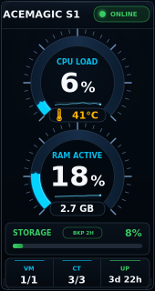 | **Instrument** | zwei große Halbkreisinstrumente; produktive Referenz | 0 |
| 2 | 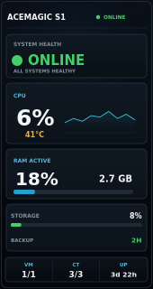 | **Executive** | großer Gesundheitsstatus und ruhige Werteblöcke | 2 |
| 3 | 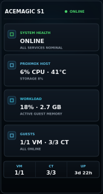 | **Operations** | klar benannte Betriebs- und Gaststatuskarten | 2 |
| 4 | 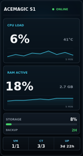 | **Telemetry** | CPU- und RAM-Trends als Hauptinformation | 3 |
| 5 | 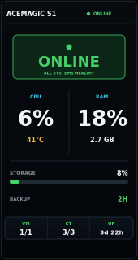 | **Minimal** | maximale Fernablesbarkeit und wenig Ablenkung | 3 |
| 6 | 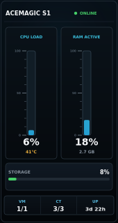 | **Precision** | vertikale kalibrierte Messleisten | 4 |
| 7 | 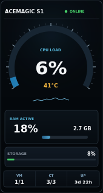 | **Grand Touring** | asymmetrisches Premium-Instrument mit Automotive-Anmutung | 1 |
| 8 | 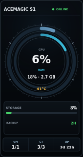 | **Atelier** | konzentrisches Instrument im ruhigen Uhrendesign | 1 |
| 9 | 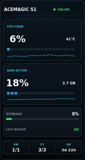 | **Signature** | segmentierte Präzisionsleisten und zurückhaltende Mikrotrends | 4 |
| 10 | 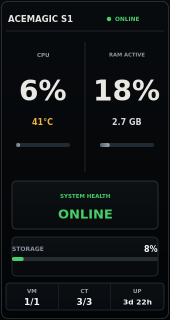 | **Obsidian** | nahezu monochrome, materialbetonte Split-Ansicht | 1 |
| 11 | 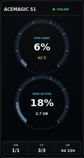 | **Chronometer** | zwei vollständige klassische Rundinstrumente | 4 |
| 12 | 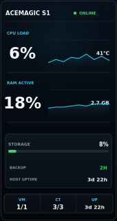 | **Horizon** | horizontale Ebenen mit großen ruhigen Trends | 2 |
| 13 | 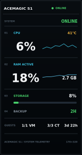 | **Architect** | strenges typografisches Raster ohne Dekoration | 3 |

## Gemeinsamer Datenvertrag

Jedes Design erhält dieselben normalisierten Daten und darf keine eigene
Messwerterfassung einführen:

- Gesamtzustand: `ONLINE`, `WARNING` oder `OFFLINE`
- Proxmox-CPU in Prozent und Hosttemperatur in Grad Celsius
- aktive Gast-RAM-Nutzung in Prozent und GiB
- Storage-Auslastung in Prozent
- Alter und Zustand des letzten Backups
- laufende und gesamte VM beziehungsweise CT
- Host-Uptime
- geglättete CPU- und RAM-Historie der letzten fünf Minuten

Fehlende oder veraltete Messwerte erscheinen eindeutig als `N/A` oder
`OFFLINE`. Kein Design darf aus fehlenden Daten einen gesunden Zustand ableiten.

## Gemeinsame Gestaltung

- native Zeichenfläche: 170×320 Pixel im Portraitformat
- dunkles Navy/Graphit statt reinem Schwarz ohne Zeichnung
- Cyan oder gedämpftes Blau für neutrale Messwerte
- Grün ausschließlich für gesunde Zustände
- Amber für Warnungen und Temperatur
- Rot ausschließlich für kritische oder unterbrochene Zustände
- keine Neon-, Cyberpunk-, Gaming- oder verspielte Sci-Fi-Optik
- keine Schrift oder Abhängigkeit nur für ein einzelnes Design
- keine unlesbaren Mikrotexte; echte TFT-Lesbarkeit hat Vorrang

## Freigabekriterien je Design

Ein Design gilt technisch als implementiert, wenn:

1. der Renderer ohne eigene Datenquelle auskommt;
2. Online-, Warning-, Offline- und N/A-Zustände sichtbar geprüft sind;
3. reproduzierbare PNG-Snapshots in nativen 170×320 Pixeln existieren;
4. Bewegung zeitbasiert, begrenzt und im Stillstand ressourcenschonend ist;
5. Vorschau und Renderer fachlich dieselben Werte zeigen;
6. Umschaltung und Rollback ohne manuelle Dateireparatur funktionieren.

Die produktive Freigabe wurde am 12. August 2026 erteilt: Jedes Design lief auf
dem echten TFT mindestens 15 Sekunden stabil. Zusätzlich lief die abschließende
Referenzansicht länger als ein vollständiges Watchdogfenster. Auswahl,
Healthcheck, unveränderte Prozess-ID, LCD-Verbindung und aktive
Gallery-Zuordnung wurden für jeden Eintrag geprüft. `Instrument` blieb
anschließend als Hauptdesign aktiv.
